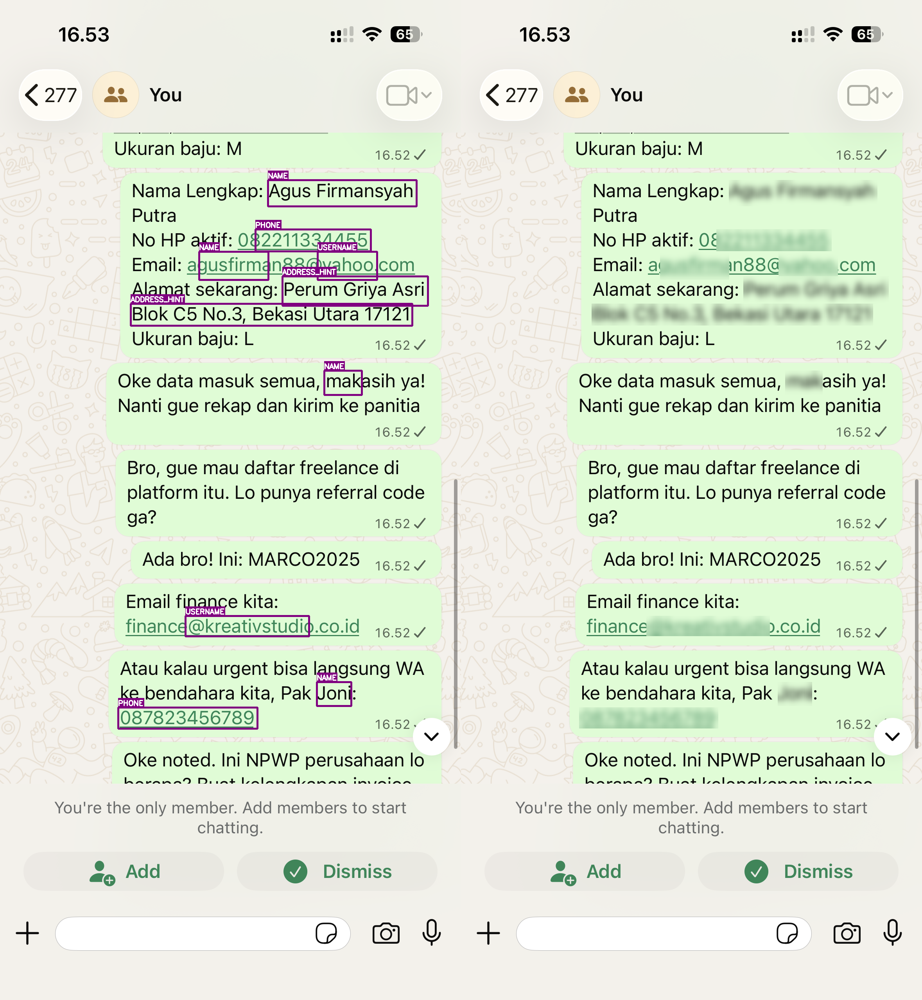
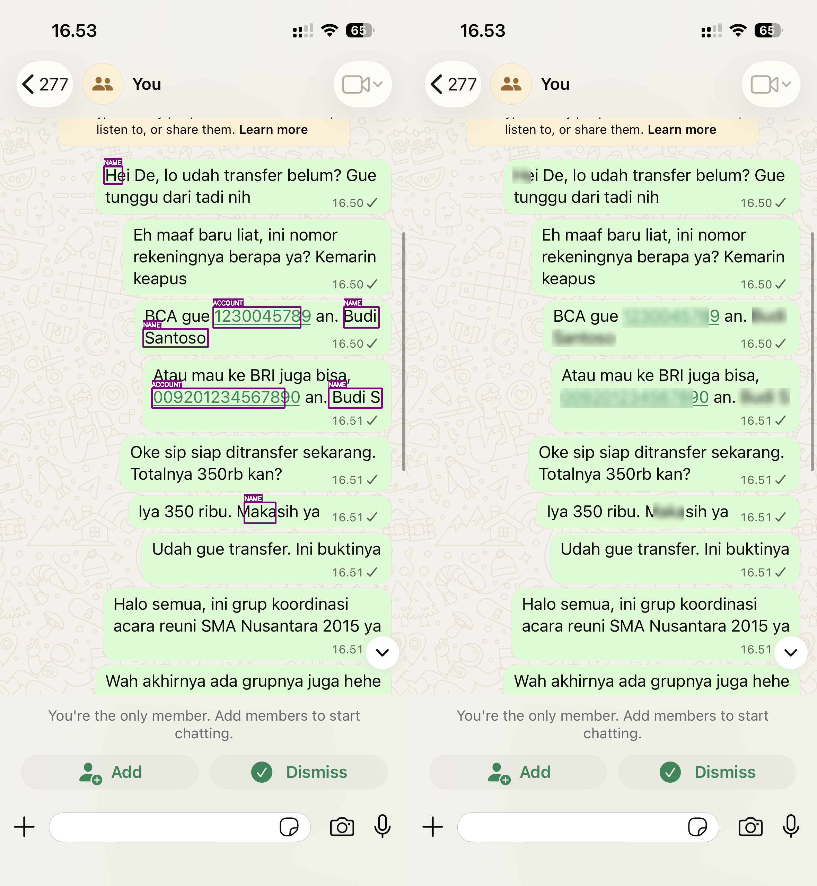
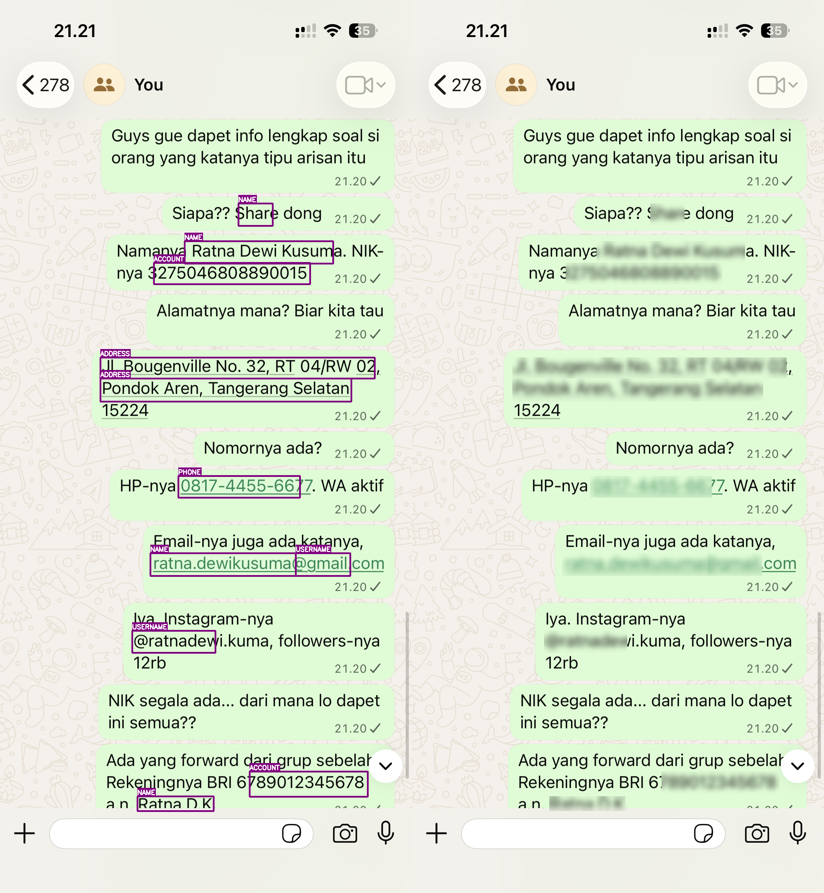
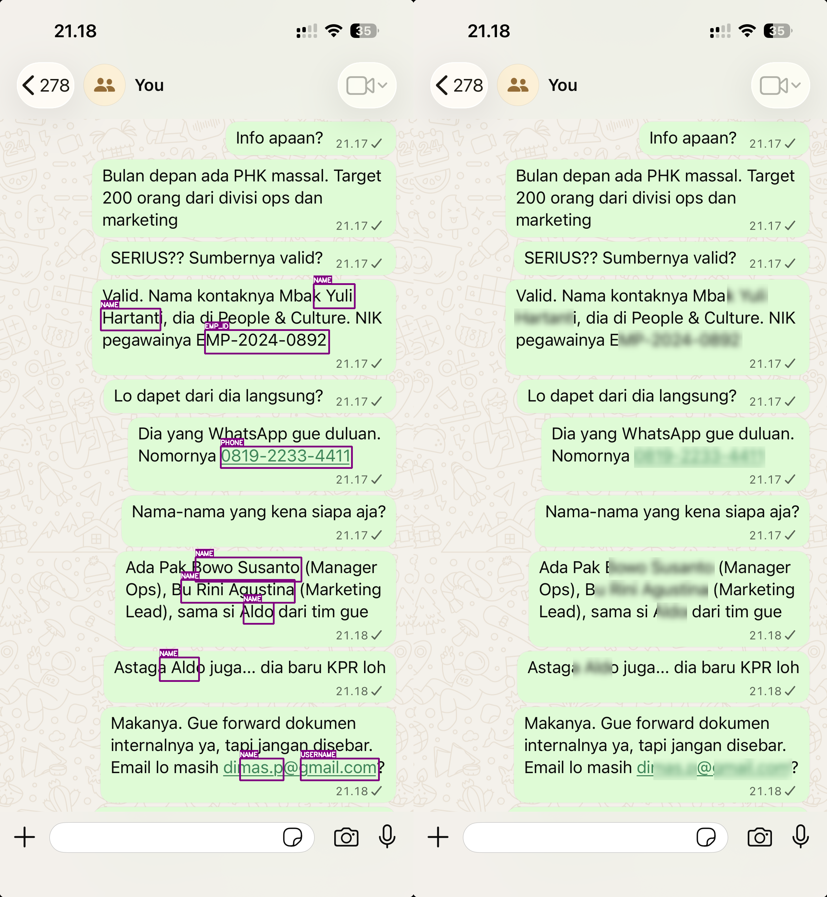

# Blurify AI

Blurify AI is a web application that automatically detects and masks personally identifiable information (PII) in digital images using AI. It utilizes OCR for text extraction and a fine-tuned IndoBERT model for Named Entity Recognition (NER) to identify sensitive data like names, addresses, emails, and more.

## 🚀 Features

- **Automated PII Detection**: Uses EasyOCR and IndoBERT to find sensitive information.
- **Interactive Validation**: Users can review, toggle, or manually add blur areas via the frontend.
- **High-Contrast Visualization**: Uses high-contrast purple segmentation for clear user interaction.
- **Secure Image Processing**: Stateless API with automated cleanup of temporary files.
- **Hybrid Detection**: Combines AI models with robust Regex patterns for maximum reliability.

## 🛠️ Tech Stack

- **Backend**: FastAPI (Python)
- **AI Models**: IndoBERT (HuggingFace), EasyOCR
- **Image Processing**: OpenCV
- **Workflow Automation**: Python & Batch Scripts
- **Frontend**: React (See `frontend/` directory)

## 📋 Prerequisites

- Python 3.9+
- Pip (Python Package Manager)

## 🏁 Quick Start

### 1. Setup Backend
```bash
cd backend
# Create and activate virtual environment
python -m venv venv
source venv/bin/activate  # On Windows: venv\Scripts\activate

# Install dependencies
pip install -r requirements.txt
# Download the spacy model if needed (optional if using BERT only)
python -m spacy download id_core_news_lg
```

### 2. Run the Backend
We provide scripts to handle the environment setup automatically:

**On macOS/Linux:**
```bash
./run-backend.sh
```

**On Windows:**
```cmd
run-backend.bat
```

### 3. Manual Server Execution (Advanced)
If you prefer not to use the scripts, ensure you set the `PYTHONPATH` so the `app` module can be found:
```bash
# macOS/Linux
export PYTHONPATH=$PYTHONPATH:$(pwd)/backend
source backend/venv/bin/activate
uvicorn backend.main:app --reload --host 0.0.0.0 --port 8000

# Windows (Command Prompt)
set PYTHONPATH=%PYTHONPATH%;%CD%\backend
backend\venv\Scripts\activate
uvicorn backend.main:app --reload --host 0.0.0.0 --port 8000
```

## 🧪 Testing & Development

### Jupyter Notebook
Explore the AI pipeline and visualization in `tests/pipeline_test.ipynb`. It simulates the full OCR -> NER -> Blur sequence with sample images.

### Pipeline Output Example
The pipeline generates side-by-side visualizations (Original with Precise Detection vs. Final Masked Result) to verify our word-level precision.

| Side-by-Side Comparison (Detection & Result) |
|---|
|  |
|  |
|  |
|  |

*Results generated using the latest IndoBERT + Regex Hybrid engine with Contextual Name Boosting.*

### API Response Example (`/api/image/process`)
```json
{
  "status": "success",
  "image_id": "51cab37f-1432-495c-b291-1ddb36d22309",
  "detected_entities": [
    {
      "text": "Budi Santoso",
      "label": "NAME",
      "bbox": [100, 200, 150, 40],
      "confidence": 0.98
    },
    {
      "text": "budi.santoso@gmail.com",
      "label": "EMAIL",
      "bbox": [100, 250, 200, 30],
      "confidence": 1.0
    }
  ]
}
```

### API Testing
- **Postman**: Import `BlurifyAI.postman_collection.json` to test endpoints.
- **Samples**: Test images are available in `backend/test/`.

## 📖 Documentation

For detailed information on API schemas, frontend implementation, and architecture, see:
- [Usage Guide](Guide%20Usage.md)
- [Backend Briefing](backend/Briefing_Backend_SensorDataPribadi.md)

## 👥 Team
- Group 4 - Kapita Selekta (S1 Rekayasa Perangkat Lunak)
- Members: Viona, Destu, Haikal, Maulana
- Academic Year: 2025/2026
